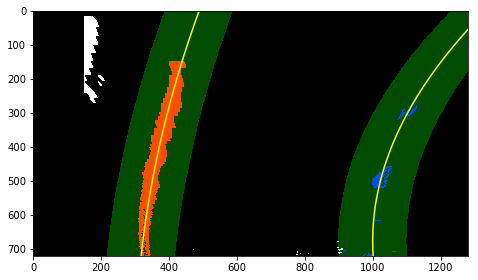
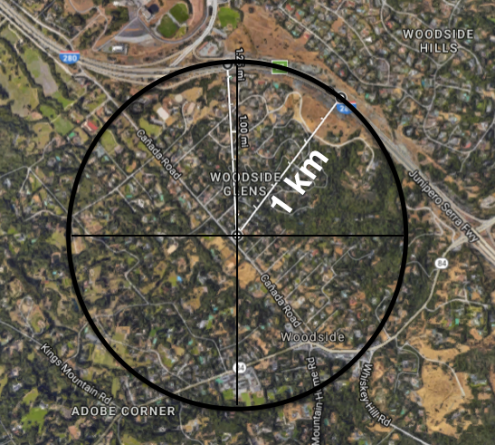
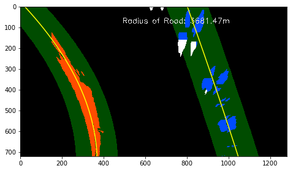

# Advanced Lane Finding Project

## Overview
The project is part of the Udacity Self-driving Car Nanodegree program. The goal of the project is to use a set of methods that can detect lanes in a more robust way, regardless, for example, the weather, the condition of the road, the lighting or any other possible factors.

## Outline
The following steps will be taken in order to achieve the goal.
1. **Camera calibration**—there is no such thing as a perfect lens. When taking a picture with a camera, we are projecting 3D objects onto a 2D platform and very often the image taken is subject to optical distortion due to the optical design of the lens. The camera is essentially what the self-driving car perceives the world through, and if the image itself is distorted, so will the perception be. And we certainly wouldn't want that. So in this step we will:
	* Use a set of chessboard images to compute the *camera calibration matrix* and the *distortion coefficient*.
	* We can then use the matrix and coefficients to correct the distortion of our images. 
2. **Extract crucial visual information from the image**—in the image taken from the front camera of a self-driving car, most of the pixels are not really useful, i.e., the sky, the trees, the buildings. And if we only concern ourselves with the lanes, even other cars are completely irrelevant. So in this step we will
	* Apply a couple of color and gradient transforms to see which methods work best at extracting the lane information.
	* Convert the combined result of the previous step and create a binary image to make those feature pixels stand out even more.
3. **Perspective transform**—just like human drivers pay attention to the curvature of the road to determine how much they should steer their wheels, so does a self-driving car. We need to calculate the curvature of the road so that later me may feed that information to the car. However, when the car is driving on the road facing forward, you have a picture of one-point perspective where the farther things are the smaller they look, and everything kind of converges and vanishes in the middle of the view. In this perspective, parallel lines don't appear parallel, and we have a problem. To solve this, we need to do a perspective transform that transforms the current one-point perspective to a birds-eye perspective which fixes the perspective distortion that we talked about just above. 
4. **Detect lane pixels and find the lane boundary**—using the transformed image we parametrize the lane pixels using quardratic functions to get more solid boundaries.
5. **Calculate the curvature of the lane at the vehicle's position**—when it's on the go, a self-driving car needs to know how much to turn left or right, based on the curvature of the road, we can use the parametriized lanes we just got to calculate the curvature of the lanes at the car's current position.
6. **Warp the parametric boundaries back to the original image and mark the boundaries and the curvatures on the image**

## Camera Calibration
I use the following chessboard images which are taken using the same camera as the car to calibrate the camera.

As said in the outline, in order to distort any images taken by this camera, we will need the camera calibration matrix and the distortion coefficient. This can be done very easily using OpenCV's `cv2.calibrateCamera()` method. Essentially we feed `objpoints`, `imgpoints` and the image shape into the method and it outputs the matrix and the coefficient that we need, where `objpoints` stand for object points, and `imgpoints` stand for image points. As said earlier, when taking an image, we're essentially mapping 3D stuff to 2D so it's just a dimensionality reduction. If the lens is designed well, this mapping is sort of linearish. Given enough data, we can fit a linear function to them and recreate the distortion function. And this is exactly what we are doing here. The chessboard in reality is all the same, so our object points are all the same too, whereas the mapped image points are all different. So here we can first use the `cv2.findChessboardCorners()` method to locate the positions of the image points. Once we have the object points and image points we can then apply the `cv2.calibrateCamera()` method to get our matrix and the coefficient. We can then use them to undistort any images taken with this camera. The code snippet is in cell `[2]` of the iPython notebook `advanced_lane_detection.ipynb` (from this point on we will just call it the notebook).

And here's a sanity check on the image `calibration2.jpg`:

And a before/after comparison on the real stuff (`test1.jpg`):
**Before**

**After**

## Extract crucial visual information from the image

Here I decided to use the combined gradient of the original image in RGB color space and the saturation channel information in the HLS space to form a binary image that better represents the lane information in the image.

First let's take a look again at the undistorted version of the image:

### Combined gradient binary
The combined gradient image I use consists of the following components:
* Absolute gradient in the x direction
* Absolute gradient in the y direction
* A combination of the magnitude of the both of the gradients
* Arc tangent of the two gradients

In short, all the gradients can be computed using Sobel operator `cv2.Sobel()`. The functions that compute the gradient are in cell `[3]` of the notebook and the arguments and how they're combined and converted to one binary image are in the code of the `pipeline()` function (cell `[6]`, line `18` to line `27`). 

Here the combined gradient image of `test1.jpg`. 

We can see that it is able to detect the right lane all right but not so successful on the left lane (well, it's not there at all!). The reason why this is happening is because before calculating the gradients I have applied a simple average grayscale to the image. And in this particular image, the road is lit by harsh sunlight which makes the pixel values of its grayscaled version very close to the yellow lane's. This is why we need a backup plan. And that backup plan, as said earlier, is the saturation channel.

### Saturation channel binary
To get the saturation binary image, we first need to extract the saturation channel of the HLS representation of the image. Again OpenCV has got all this covered. We can use `cv2.cvtColor()` to convert our RGB image to HLS image with just one line of code. The resulting image now consists of three channel with saturation channel being the third.

With simple numpy slicing we can get the saturation channel information, and we can apply a bunch of thresholds to the image and make it binary. This is again done in the `pipeline()` function (line `38` to line `45`).

Here's the saturation channel binary of `test1.jpg`:

Ta-da! The reappearing of the mysterious left lane! 

And here is a color binary of the two methods combined:

We can clearly see these two methods are good at picking up different stuff, which is why they make a good couple!

And finally, the black and white version of the color binary.

We shall now proceed using this binary for perspective transformation. Next stop, perspective transform!

## Perspective transform
To do a perspective transform to an image, we need to determine the points in the current perspectively distorted image that we know should form a rectangle, and we can then map those points to locations in the image where they together do form a rectangle. Here we can make use of OpenCV's `cv2.getPerspectiveTransform()` method to get the matrix of transform (and its inverse so that we can do transforms in both ways), once we have decided what points to map and where to map them. We can then use `cv2.warpPerspective()` to map the rest of the points of the image to where they belong using the matrix we've just got.

To do this we need to know what points in the image form a rectangle in reality. This is not very easy to do with the `test1.jpg` image that we've been using since everything in it seem to have a wacky shape.  We'll need an image where the car is driving straight on a road segment that is also straight. Here I choose to use `straight_lines1.jpg` and here's what I get:

Not too shabby.

I made a `perspective_transform()` function for this part in cell `[4]`.

## Detect lane pixels and find the lane boundary
The idea behind finding lane boundaries is simple. However, describing it can be a little bit wordy (see cell `[5]`,  from line `4` to line `102`; the pyplot lines are commented out). Here's a concise version of the how-to:
1. Turn the the bottom half of the image into a histogram where the x-axis is the column-axis of the image and y-axis is the count of 1s in each column. Since we have already done a perspective transform, the image now has most of the stuff cropped out.
2. the peak in the left side of the image will happen in where most of the left lane pixels are, and similar with the peak on the right side where it would represent a centerish point for the right lane. 
3. Cut the image into $n$ segments vertically, and in each segment we start with the peak location and define a box where we will look for the lane pixels.
4. If the number of 1s in that box we have just defined is above some threshold, we calculate the mean of those points and center the next box on that point to do the next search.
5. In the process we record the locations of the pixels within the boxes, and then fit a quadratic function. And we're done!

Again let's borrow the `test1.jpg`  to demonstrate the result:

Looks good!

## Calculate the curvature
Now that we have the lanes in their parametric forms, we can easily calculate the curvatures using the following formula:

$$
R_{\text{curve}} = \frac{(1 + (2 A y + B)^2)^{3/2}}{|2 A|}
$$

where $A$ and $B$ are the coefficients in the parametric function we use to fit the lanes:

$$
f(y) = A y^2 + B y + C
$$ 

Using Google Maps we know that the image is taken somewhere near the Udacity HQ where the curvature of the big left turn is about 1km. 

So we can do a sanity check using the image of that location (`test2.jpg`):

It's not perfect but at least both are within the same order of magnitude of the real curvature. As seen in the image, the lanes are detected and fitted just fine. To get a more accurate radius, we can average them up like so:

Yeah, much better.

This part of the code is also part of the `draw_area()` function in cell `[5]`. See line `122` to line `138`.

## Warp back and mark the driving area
Now putting it all together and voila!

Works like a charm!

## Pipeline (video)
Let's see how it works with video.

https://youtu.be/d_YhuohSjuo

## Discussion

### Pros
This project is very similar to the what we have done before with lane detection using only gray-scaled RGB images and canny edge detection method. The main differences that make the methods we use in this project more robust I believe are the following:

1. We use a good variety of methods such as RGB gradients, RGB channel images, HLS channel images, and then convert the combination of them manually to a single binary image that works best for most cases. For the moment though not perfect, it's already working extremely well compared to what I used to do with only PCA gray scale.
2. We fit lane lines using quadratic functions instead of linear ones which makes a lot more sense, since roads are not, strictly speaking, straight.

### Cons
1. **Lane detection**
The method in it's current state is already quite robust. However, since I'm only using the saturation channel binary the combined gradient binary, in cases where sunlight is extremely harsh, it can give the gray road good saturation, and also all the contrasts between the lanes and the road can be washed out. I have explored using the gradient of the hue channel which seems to be able to avoid this problem in most cases. I didn't use it here as it's quite difficult to make it work with the other two methods that I'm using here. It's got good potentials, though.

2. **Curvature calculation**
The perspective transform for the moment is not strictly speaking a birds-eye view since the warp done on the x-axis is different from what's done on y-axis. So in reality the lanes should form a long, skinny rectangle whereas here we make it into a squarish one. However, the longer and skinnier the rectangle, the more the car is able to see and also we can have more middle lane information which is crucial for us to fit the quadratic function. So a better way to fix this and make the calculation more accurate is that we need to use a larger image to map the rectangle to.